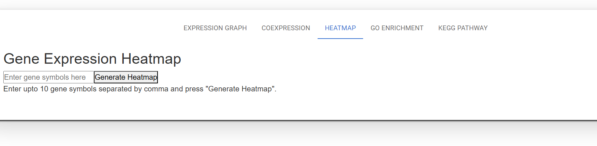

# LIRTS-Viewer

## Welcome to the Lens Injury Response Time Series (LIRTS) Viewer which is a resource for visualization of gene expression changes during lens injury response induced after cataract surgery.

### The initial framework of the resource was developed in collaboration with the University of Delaware Computer Science Senior Capstone Design Team. The resource is now hosted via the University of Delaware computational cluster Biomix.

Web Hosting
Node Package Manager (NPM) version 8.19.4 (node version 16.20.1) was utilized to build a compilation folder by running the default command
> npm run build

The resulting build folder with the compiled files and images was launched using an Apache server hosted on Biomix, a high-performance computing cluster at the University of Delaware, at the URL https://lirts.dbi.udel.edu/.

The LIRTS Viewer consists of the following tools:
1. Expression Graph
2. Coexpression
3. Heatmap
4. GO Enrichment
5. KEGG Pathway

#### Expression Graph

This tool helps to generate gene expression graphical plots across six time points ranging from 0 to 120 hours after cataract surgery. The plots are being generated using Plotly Typescript in the backend. Currently, there are three type of plots that can be generated which includes Box & Scatter, Boxplot, and Scatterplot. All the generated plots can be easily downloaded in svg format by using the camera icon placed at the right-hand corner of the plot. The + and - icons can be used to zoom in and out of the plot while double crossed arrow is an autoscale feature which reverts the plot to the original shape. The home icon is for resetting the axes.

#### Coexpression

This tool helps to find genes which are correlated with a gene of interest entered in the search box. This will yield a table containing all gene pairs containing the gene of interest and other genes in the form of gene pairs which have very strong correlation. The table also contains the corresponding correlation values for each of the gene pair. This can be downloaded as a csv file.

#### Heatmap

This tool offers the ability to generate heatmaps for genes which can be viewed together. Currently, it offers heatmap generation for at most ten genes simultaneously which can be entered into the search box separated by comma. This heatmap is easily downloadable using the camera icon on the right hand corner of the plot.

#### GO Enrichment

This tool shows the Gene Ontology enrichment of biological processes for each of the individual datasets- 0vs6hr, 0vs24hr, 0vs48hr, 0vs72hr and 0vs120hr. The results are displayed in a decreasing order of number of genes associated with each term. These results are presented in a tabular format and can be downloaded as a csv file.

#### KEGG Pathway

This tool displays the enrichment of KEGG pathways for each of the individual datasets- 0vs6hr, 0vs24hr, 0vs48hr, 0vs72hr and 0vs120hr. The results are displayed in a decreasing order of number of genes associated with each term. These results are presented in a tabular format and can be downloaded as a csv file.

